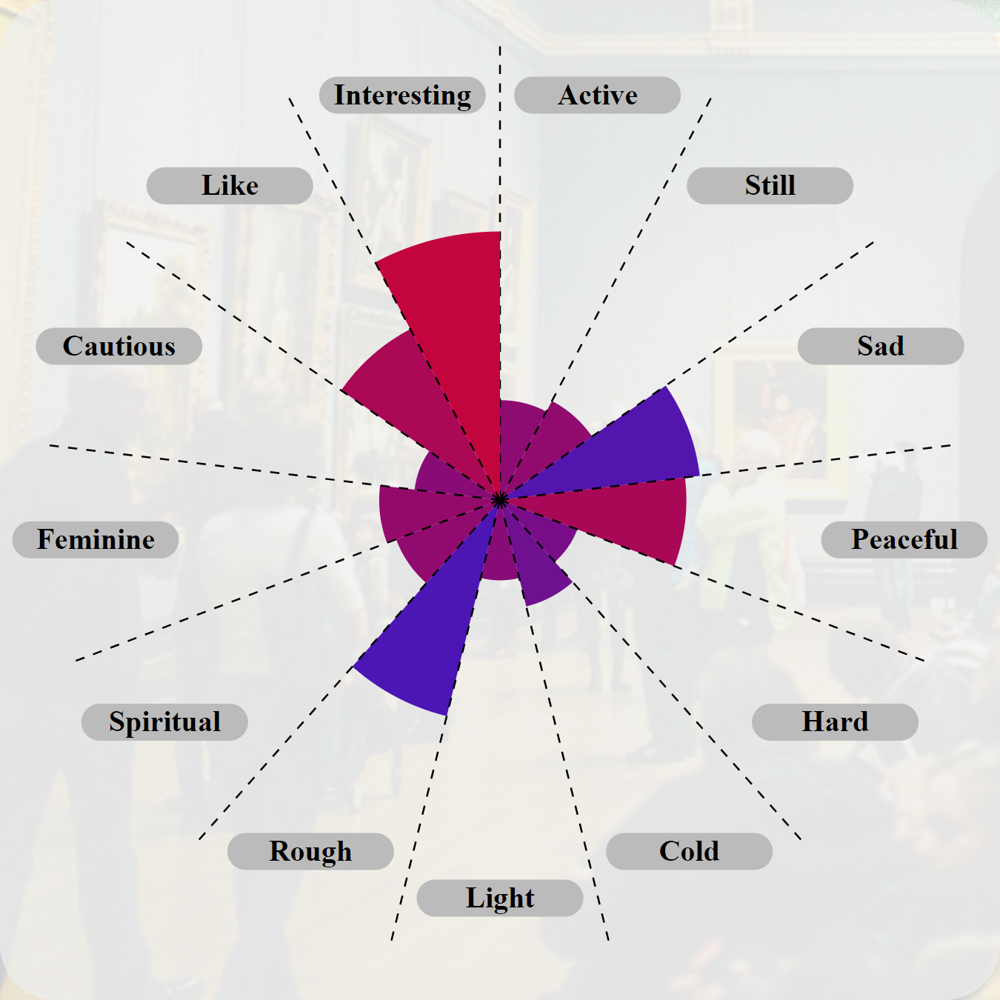

      
# Description of the project
> [!IMPORTANT]
> The project aims to
> - develop a system for visualizing a dataset that is intended to represent eight networks that model an aesthetic experience of the viewers when observing artworks;
> - create impactful charts or infographics from data through D3.js (JavaScript library).
> 
> The dataset used in the project are the result of the research presented in the article "Associating With Art: A Network Model of Aesthetic Effects by Specker et al" which was shared by the authors of the article to have the opportunity to know "how to visualize this data set for an art historical audience or other audience that does not know about network theory". 


# Illustration of source data
<table align="center">
	<tr>
		<th>Table example</th>
	</tr>
	<tr>
		<td width=90%></td>
	</tr>
</table>

> [!IMPORTANT]
> The source dataset (.xlsx) for each of the paintings analyzed contains a sheet showing a table on which the relationships between the aesthetic effects tested are contained. The aesthetic effects used are the following (each effect is reported together with its opposite):
> - ***positive — negative***
> - ***active — passive***
> - ***still — lively***
> - ***sad — happy***
> - ***peaceful — aggressive***
> - ***hard — soft***
> - ***cold — warm***
> - ***light — heavy***
> - ***rough — smooth***
> - ***spiritual — bodily***
> - ***feminine — masculine***
> - ***cautious — intrusive***
> - ***like — dislike***
> - ***interesting — uninteresting***
> 
> The numerical value has a:
> - minimum value of -1.0 (maximum correlation between one of the two aesthetic effects and the opposite of the other);
> - mean value of 0 (no correlation between the two aesthetic effects)
> - maximum value of 1 (maximum correlation between the two aesthetic effects).
> 
> Consequently, if a given connection (e.g., between ***positive*** and ***active***) recorded a positive value (0.108), then, considering the opposite of either (***positive*** and ***passive***), the value becomes negative (-0.108).
> 
> The goal of the project is to create visualization graphs that effectively show the connections between the aesthetic effects experienced during the observation of each painting, with the objectives of:
> - make all the reproduced aesthetic effects and their connections visible in a compact manner;
> - make the differences between the various reproduced connections visibly evident during total viewing;
> - give the ability to focus on a specific connection and view the complete data about it.


# Illustration of graphs obtained
## Specific description for each created graph
### Cartesian graphs
<table align="center">
	<tr>
		<th>Graph</th>
		<th>Color legend</th>
		<th>Width legend</th>
	</tr>
	<tr>
		<td width=64.3%></td>
		<td width=21.3%></td>
		<td width=14.4%></td>
	</tr>
</table>

> [!IMPORTANT]
> #### **Object representing the connection between aesthetic effects:**
> - 📌 The graph is depicted through a cartesian plane;
> - 📌 Each connection is represented by a circle connected vertically and horizontally to two aesthetic effects.
>         
> #### **Ways of representing the connection between aesthetic effects:**
> * 🔵 Circle radius length: it's directly proportional to the absolute value to be represented, so
>   * it is useful in observing whether the two aesthetic effects are correlated or connected very slightly, but
>   * it does not give information regarding the positivity or negativity of the correlation;
> * 🔵 Circle color: it is based on color legend, with two very different colors between extreme positivity or negativity, so
>   * it is very useful for differentiating positive and negative values, but
>   * very low values, both negative and positive, have little different colors and therefore confusable.
> 
> #### **Is it possible to visualize the connection between all aesthetic effects considered in a single graph?**
> - ⭕ All connections are visible in a single graph, specific to the painting to which they relate; however,
> - ⭕ each connection between aesthetic effects is reported twice in the graph.
<br/>

### Table graphs
<table align="center">
	<tr>
		<th>Graph</th>
		<th>Color legend</th>
	</tr>
	<tr>
		<td width=75.2%></td>
		<td width=24.8%></td>
	</tr>
</table>


### Force directed graphs
<table align="center">
	<tr>
		<th>Graph</th>
		<th>Color legend</th>
		<th>Width legend</th>
	</tr>
	<tr>
		<td width=60.5%></td>
		<td width=20.1%></td>
		<td width=16.4%></td>
	</tr>
</table>


### Circular graphs
<table align="center">
	<tr>
		<th>Graph</th>
		<th>Color legend</th>
		<th>Width legend</th>
	</tr>
	<tr>
		<td width=60.5%></td>
		<td width=20.1%></td>
		<td width=16.4%></td>
	</tr>
</table>


### Radius graphs
<table align="center">
	<tr>
		<th>Graph</th>
		<th>Color&radius legend</th>
	</tr>
	<tr>
		<td width=60%></td>
		<td></td>
	</tr>
</table>


### Radar graphs
<table align="center">
	<tr>
		<th>Graph</th>
		<th>Painting legend</th>
	</tr>
	<tr>
		<td width=70.5%></td>
		<td width=29.5%></td>
	</tr>
</table>


### 3d force directed graphs
<table align="center">
	<tr>
		<th>Graph</th>
		<th>Color legend</th>
	</tr>
	<tr>
		<td width=75.2%></td>
		<td width=24.8%></td>
	</tr>
</table>


### Surface graphs
<table align="center">
	<tr>
		<th>Graph</th>
		<th>Color legend</th>
	</tr>
	<tr>
		<td width=87%></td>
		<td width=13%></td>
	</tr>
</table>

## Description of development mode
Both the graphs and their respective legends are created via a D3.js, a JavaScript library for producing dynamic, interactive data visualizations; this library allows images to be developed as *.svg* (Scalable Vector Graphics). The central design concept of D3 is to allow the programmer to use selectors to choose nodes within the DOM and then use operators to manipulate them.

### Code example for the graph

```javascript
// Creating new svg over a div for the graph
this.svg = elementDiv.append("div")
    .append("svg")
    .attr("width", this.svgDimension)
    .attr("height", this.svgDimension)
    .attr("viewBox", [0, 0, this.svgDimension, this.svgDimension])
    .append("g");
```
	
```javascript
// Creating internal svg content
this.svg.append('circle')
    .attr('cx', xCoord)
    .attr('cy', yCoord)
    .attr('r', this.linearScale(Math.abs(value)))
    .attr('stroke', 'black')
    .attr('fill', colorScale(value))
    .on("mouseover", () => {
	this.svg.select("#" + effect + "ver").transition().duration(500).style("fill", "#0BDA51");
	this.svg.select("#" + otherEffect + "hor").transition().duration(500).style("fill", "#0BDA51");
    })
    .on("mouseout", () => {
	this.svg.select("#" + effect + "ver").transition().duration(500).style("fill", "black");
	this.svg.select("#" + otherEffect + "hor").transition().duration(500).style("fill", "black");
    })
    .append("title")
    .text(value);
```

### Code example for legends
```javascript
// Creating images and numbers to form a legend
const legendscale = d3.scaleLinear()
	.range([1, svgDimension - legendMargin.top - legendMargin.bottom])
	.domain(colorScale.domain());

const legendaxis = d3.axisRight()
	.scale(legendscale)
	.tickSize(6)
	.ticks(8);

const svg = colorLegendContainer
	.append("svg")
	.attr("height", svgDimension)
	.attr("width", legendWidth);

svg.append("g")
	.attr("class", "axis")
	.attr("transform", "translate(" + (legendMargin.right + 80 + legendMargin.left/2) + "," + (legendMargin.top) + ")")
	.call(legendaxis);

svg.append("rect")
	.attr("x", legendMargin.left)
	.attr("y", legendMargin.top)
	.attr("width", 80)
	.attr("height", svgDimension-legendMargin.top-margin.bottom)
	.attr("fill", "url(#" + tag + "colorGrad)");
```
