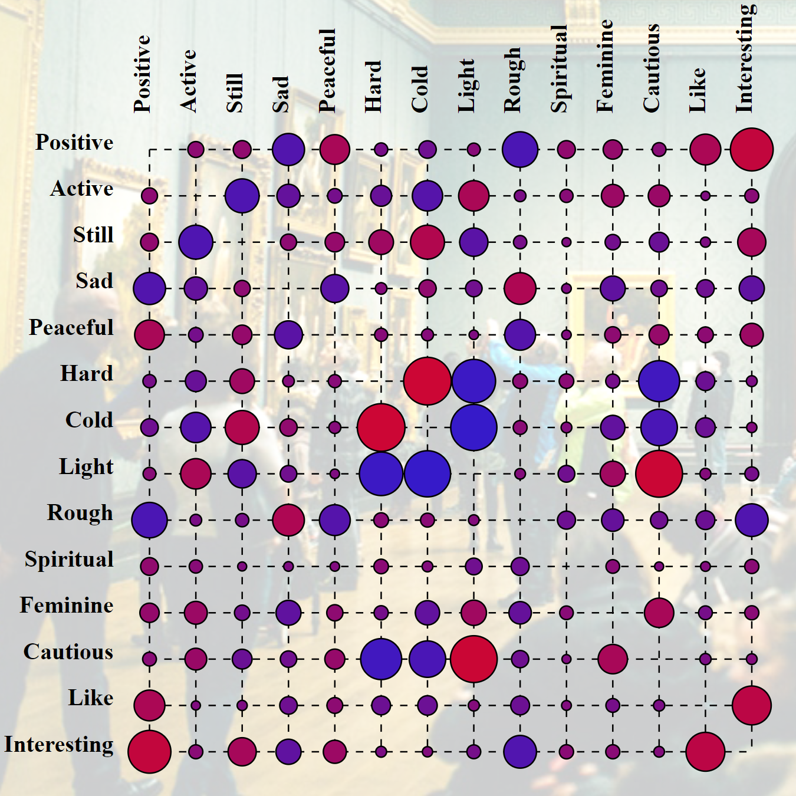
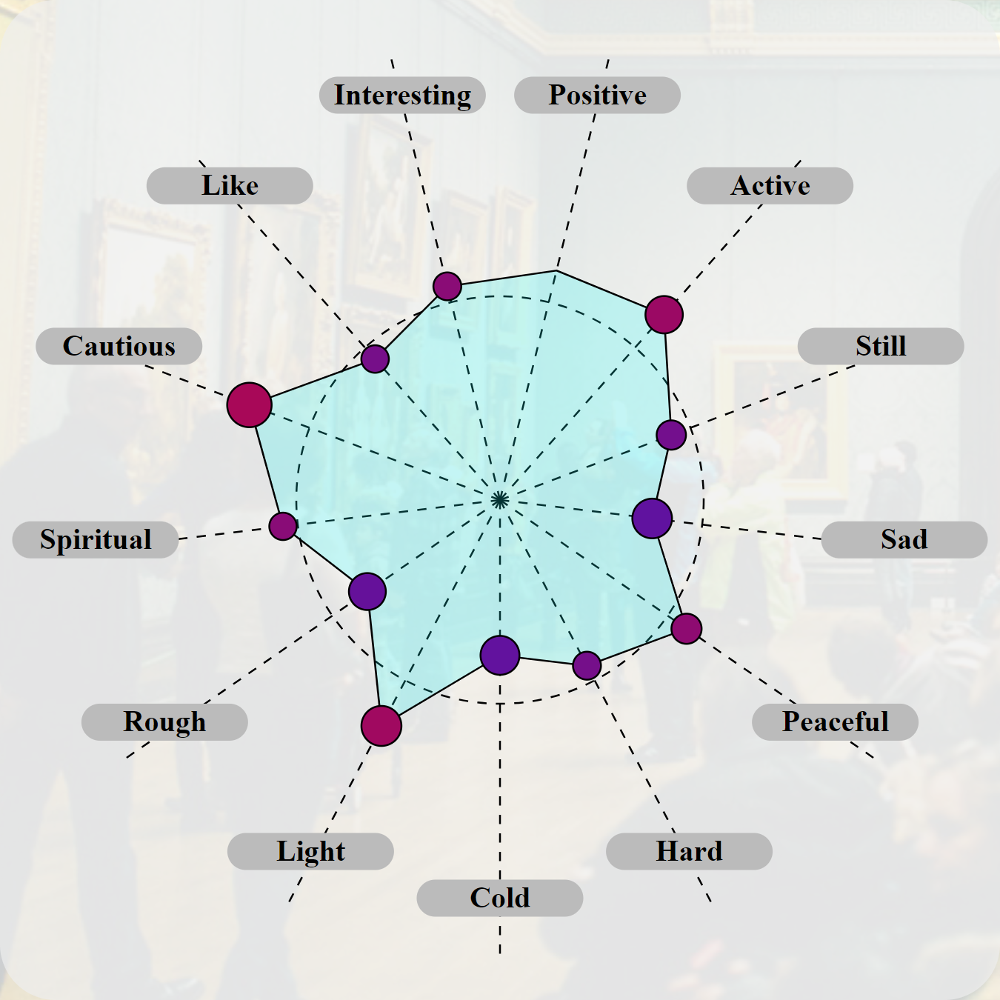

# AestheticExperienceNetwork

## Description of the project
The project aims to
- develop a system for visualizing a dataset that is intended to represent eight networks that model an aesthetic experience of the viewers when observing artworks;
- create impactful charts or infographics from data through D3.js (JavaScript library).

The dataset used in the project are the result of the research presented in the article "Associating With Art: A Network Model of Aesthetic Effects by Specker et al" which was shared by the authors of the article to have the opportunity to know "how to visualize this data set for an art historical audience or other audience that does not know about network theory". 

## Illustration of source data
<table align="center">
	<tr>
		<th>Table example</th>
		<th>Color legend</th>
	</tr>
	<tr>
		<td width=90%></td>
		<td width=10%></td>
	</tr>
</table>

The source dataset (.xmls) for each of the paintings analyzed contains a sheet showing a table on which the relationships between the aesthetic effects tested are contained. The aesthetic effects used are the following (each effect is reported together with its opposite):
- ***positive — negative***
- ***active — passive***
- ***still — lively***
- ***sad — happy***
- ***peaceful — aggressive***
- ***hard — soft***
- ***cold — warm***
- ***light — heavy***
- ***rough — smooth***
- ***spiritual — bodily***
- ***feminine — masculine***
- ***cautious — intrusive***
- ***like — dislike***
- ***interesting — uninteresting***

Consequently, if a given connection (e.g., between ***positive*** and ***active***) recorded a positive value (0.108), then, considering the opposite of either (***positive*** and ***passive***), the value becomes negative (-0.108).

The goal of the project is to create visualization graphs that effectively show the connections between the aesthetic effects experienced during the observation of each painting, with the objectives of:
- make all the reproduced aesthetic effects and their connections visible in a compact manner;
- make the differences between the various reproduced connections visibly evident during total viewing;
- give the ability to focus on a specific connection and view the complete data about it.

## Illustration of graphs obtained
### Cartesian graphs
<table align="center">
	<tr>
		<th>Graph</th>
		<th>Color legend</th>
		<th>Width legend</th>
	</tr>
	<tr>
		<td width=64.5%></td>
		<td width=21.3%></td>
		<td width=14.2%></td>
	</tr>
</table>

### Table graphs
<table align="center">
	<tr>
		<th>Graph</th>
		<th>Color legend</th>
	</tr>
	<tr>
		<td width=75.2%></td>
		<td width=24.8%></td>
	</tr>
</table>

### Force directed graphs
<table align="center">
	<tr>
		<th>Graph</th>
		<th>Color legend</th>
		<th>Width legend</th>
	</tr>
	<tr>
		<td width=60%></td>
		<td width=22%></td>
		<td width=16%></td>
	</tr>
</table>

### Circular graphs
<table align="center">
	<tr>
		<th>Graph</th>
		<th>Color legend</th>
		<th>Width legend</th>
	</tr>
	<tr>
		<td width=60%></td>
		<td width=21%></td>
		<td width=16.7%></td>
	</tr>
</table>

### Radius graphs
<table align="center">
	<tr>
		<th>Graph</th>
		<th>Color&radius legend</th>
	</tr>
	<tr>
		<td width=60%></td>
		<td></td>
	</tr>
</table>

### Radar graphs
<table align="center">
	<tr>
		<th>Graph</th>
		<th>Painting legend</th>
	</tr>
	<tr>
		<td width=70.5%></td>
		<td width=29.5%></td>
	</tr>
</table>

### 3d force directed graphs
<table align="center">
	<tr>
		<th>Graph</th>
		<th>Color legend</th>
	</tr>
	<tr>
		<td width=74%></td>
		<td width=26%></td>
	</tr>
</table>

### Surface graphs
<table align="center">
	<tr>
		<th>Graph</th>
		<th>Color legend</th>
	</tr>
	<tr>
		<td width=87%></td>
		<td width=13%></td>
	</tr>
</table>
